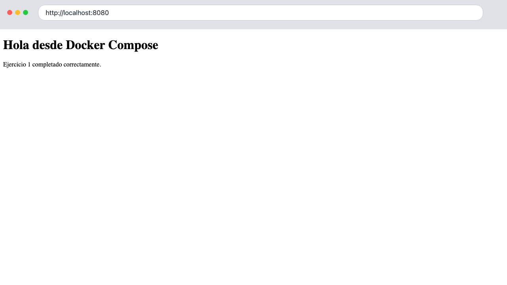
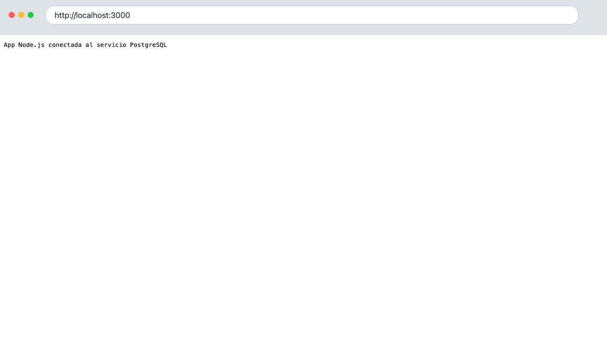
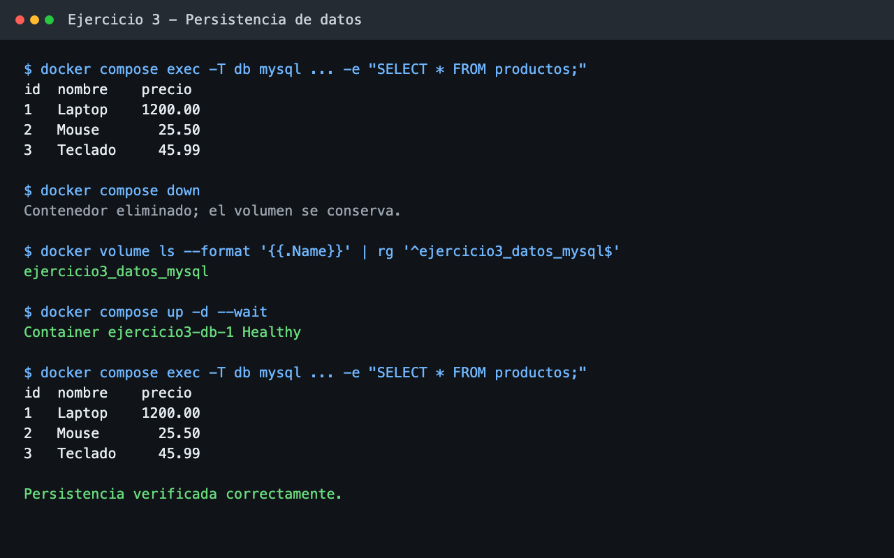
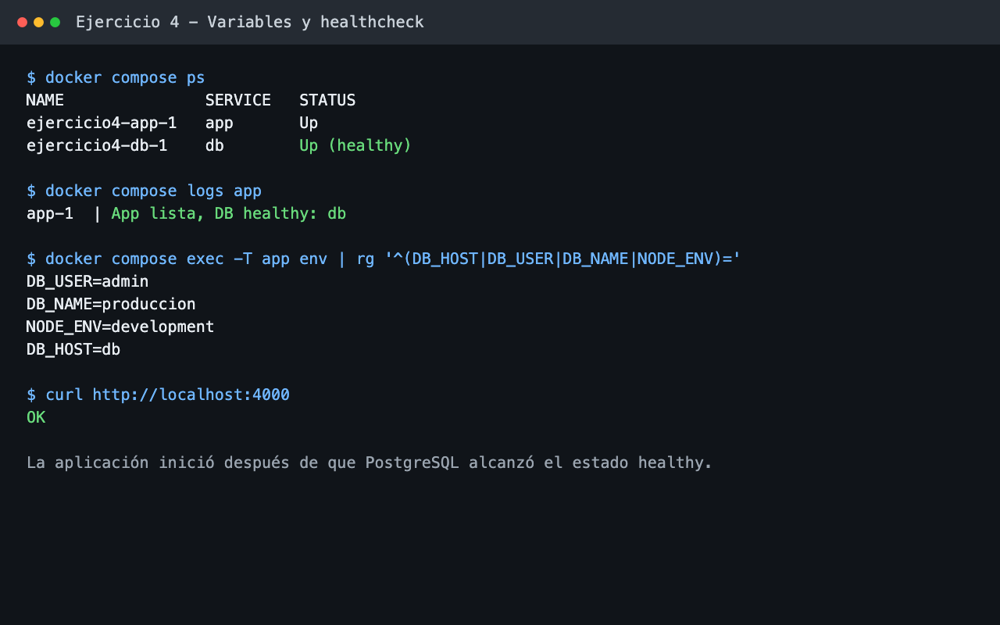
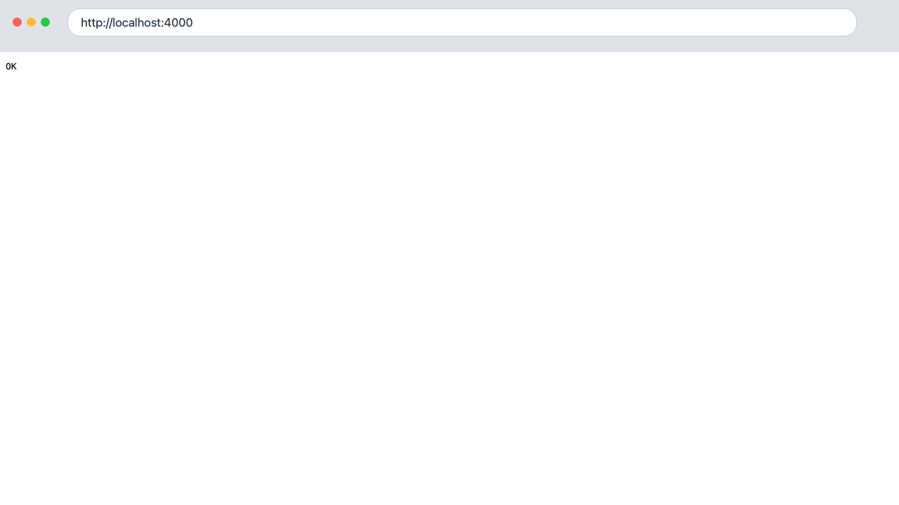

# Evidencias del laboratorio

Las siguientes capturas fueron obtenidas durante la ejecución local de los cuatro ejercicios con Docker Compose.

## Ejercicio 1 — Servicio web con Nginx

La página HTML respondió correctamente en `http://localhost:8080`.

## Ejercicio 2 — Aplicación Node.js y PostgreSQL

La aplicación respondió en `http://localhost:3000` después de verificar la conexión con el servicio PostgreSQL.

## Ejercicio 3 — Persistencia de datos en MySQL

Los productos permanecieron almacenados después de eliminar y volver a crear el contenedor. El volumen nombrado `ejercicio3_datos_mysql` se conservó durante la prueba.

## Ejercicio 4 — Variables de entorno y healthcheck

PostgreSQL alcanzó el estado `healthy`, la aplicación inició posteriormente y respondió `OK` en `http://localhost:4000`.

La respuesta HTTP del servicio también se verificó desde el navegador.

> Las credenciales utilizadas corresponden únicamente al entorno local del laboratorio. El archivo `.env` real permanece excluido del repositorio.
